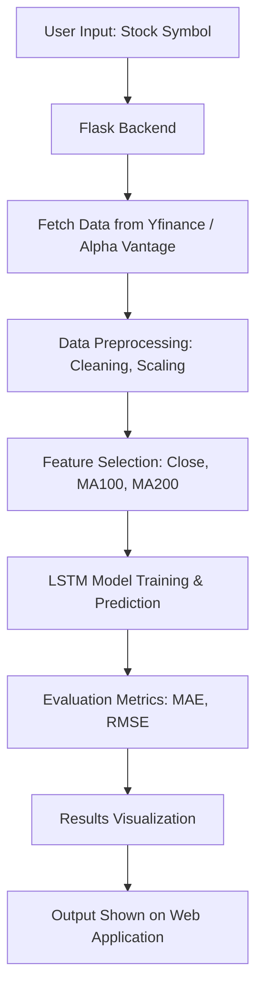

# 📈 Stock Price Prediction

> 🚀 A deep learning-powered web application for predicting stock prices using historical data and LSTM (Long Short-Term Memory) networks, deployed on AWS.


  
  
  

---

## 🌐 Live Demo
🔗 **Deployed App : ** Click Here - [Stock Price Prediction ](http://13.234.31.124:5000)

---

## 📜 Table of Contents
1. [About the Project](#-about-the-project)  
2. [Features](#-features)  
3. [Tech Stack](#-tech-stack)  
4. [Project Workflow](#-project-workflow)  
5. [Installation](#-installation)  
6. [Deployment](#-deployment)
 

 

---

## 📌 About the Project
The **Stock Price Prediction** project is designed to forecast future stock prices using historical market data.  
We use **LSTM networks** because of their ability to capture long-term dependencies in time-series data.  

The predictions are **visualized** and presented through a **Flask-based web application** for easy user interaction.

---

## ✨ Features
- 📊 **Historical Stock Data** fetching using Yahoo Finance API & Alpha Vantage  
- 🔮 **LSTM-based Deep Learning Model** for price prediction  
- 📈 **Visualization** of actual vs predicted stock prices  
- 🖥 **User-friendly Web Interface** using Flask, HTML, CSS  
- ☁ **AWS EC2 Deployment** for live access  
- 📉 **Evaluation Metrics**: MAE, RMSE  

---

## 🛠 Tech Stack

**Programming Language:** Python 🐍  
**Frameworks:** Flask, Keras, TensorFlow  
**Libraries:** Pandas, NumPy, Matplotlib, scikit-learn, yfinance, requests  
**Deployment:** AWS EC2  
**Frontend:** HTML5, CSS3  

---

## 🔄 Project Workflow


---

## 📦 Installation

Follow these steps to run the project locally:

```bash
# 1️⃣ Clone the repository
git clone https://github.com/KingRK786/Stock_Price_Prediction.git
cd Stock_Price_Prediction

# 2️⃣ Create a virtual environment
python -m venv venv
# Activate the virtual environment:
# On Linux/Mac:
source venv/bin/activate
# On Windows:
venv\Scripts\activate

# 3️⃣ Install dependencies
pip install -r requirements.txt

# 4️⃣ Run the Flask application
python app.py
```